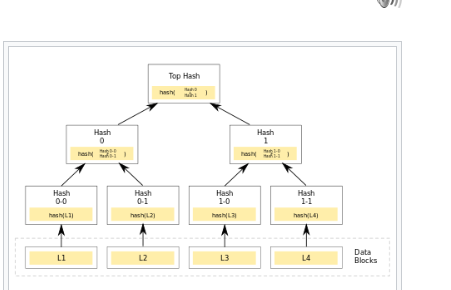

# Project5: Impl Merkle Tree following RFC6962

## 运行环境

操作系统：Ubuntu 22.04.2 LTS 64位

编译环境：C++ 使用 g++ (Ubuntu 11.3.0-1ubuntu1~22.04.1) 11.3.0，
不使用编译优化

硬件环境：11th Gen Intel® Core™ i5-1135G7 @ 2.40G   16.0 GiB

---
数据结构：


1：实现Hash值的求解

2：实现Merkle Tree的比对

原本数据：
 ['1', '2', '3', '4', '5', '6', '7', '8', '9', '10', '11', '12', '13', '14', '15', '16']，生成一个Merkle Tree

在“第三处”进行修改后，再生成一个Merkle Tree

自动通过Merkle Tree比较数据的不同位置

实验结果：

```
原本数据为： ['1', '2', '3', '4', '5', '6', '7', '8', '9', '10', '11', '12', '13', '14', '15', '16']
MerkleTree的结果为: [['6b86b273ff34fce19d6b804eff5a3f5747ada4eaa22f1d49c01e52ddb7875b4b', 'd4735e3a265e16eee03f59718b9b5d03019c07d8b6c51f90da3a666eec13ab35', '4e07408562bedb8b60ce05c1decfe3ad16b72230967de01f640b7e4729b49fce', '4b227777d4dd1fc61c6f884f48641d02b4d121d3fd328cb08b5531fcacdabf8a', 'ef2d127de37b942baad06145e54b0c619a1f22327b2ebbcfbec78f5564afe39d', 'e7f6c011776e8db7cd330b54174fd76f7d0216b612387a5ffcfb81e6f0919683', '7902699be42c8a8e46fbbb4501726517e86b22c56a189f7625a6da49081b2451', '2c624232cdd221771294dfbb310aca000a0df6ac8b66b696d90ef06fdefb64a3', '19581e27de7ced00ff1ce50b2047e7a567c76b1cbaebabe5ef03f7c3017bb5b7', '4a44dc15364204a80fe80e9039455cc1608281820fe2b24f1e5233ade6af1dd5', '4fc82b26aecb47d2868c4efbe3581732a3e7cbcc6c2efb32062c08170a05eeb8', '6b51d431df5d7f141cbececcf79edf3dd861c3b4069f0b11661a3eefacbba918', '3fdba35f04dc8c462986c992bcf875546257113072a909c162f7e470e581e278', '8527a891e224136950ff32ca212b45bc93f69fbb801c3b1ebedac52775f99e61', 'e629fa6598d732768f7c726b4b621285f9c3b85303900aa912017db7617d8bdb', 'b17ef6d19c7a5b1ee83b907c595526dcb1eb06db8227d650d5dda0a9f4ce8cd9'], ['33b675636da5dcc86ec847b38c08fa49ff1cace9749931e0a5d4dfdbdedd808a', '13656c83d841ea7de6ebf3a89e0038fea9526bd7f686f06f7a692343a8a32dca', '43587f59c00a8e528bc7636fabaffcf70cc25afc5b4d53df797faf0dc72f6dd0', 'ada17dcc2d615cc0d982a538b618f45441e798c38b1df9f3dd273e386eba1363', '76d4c0b6f7f7cc7122ea4e442c4d2a4af4578855a1dfd3803db52a38b48be8f9', '6bce5a3c8b73421b8575f01a0d2c0edb8e2c60eaca11c0452e10597d19bf32a2', '65490299ee72d212e57f8b1e48ad29236608927f12c194f5c081717a3342f746', 'c02b14a7b70952fed80df5f0a99d0a4eaf9705d50b4afeed0a6f4320e4518cba'], ['85df8945419d2b5038f7ac83ec1ec6b8267c40fdb3b1e56ff62f6676eb855e70', 'e0e2d0cec0ef7e8fc458e516dfde82890c183431a3f9efae9e4693fc23dfa36a', 'e49626d1791cd8cd84c8f7ca1e8462af8b0b810fa79d0bee41ebc49f467551ce', 'ce7b05f3b5c6f156ba8d9a1877198933adc634b67f79edd633b36159433ac4e0'], ['c27450cd3fd4df029145f3437ae9c381e0ae55e8400de06cb973005b36d7b222', '9e3af174138413346476a400f51eac6b28c4e290f072067106618e6d3f71ee57'], ['eab81849dcbf805e2189b03db985abd32cbf67c74aaee65010e53e790fab8147']]


MerkleTree的结果为: [['6b86b273ff34fce19d6b804eff5a3f5747ada4eaa22f1d49c01e52ddb7875b4b', 'd4735e3a265e16eee03f59718b9b5d03019c07d8b6c51f90da3a666eec13ab35', '4e07408562bedb8b60ce05c1decfe3ad16b72230967de01f640b7e4729b49fce', 'ef2d127de37b942baad06145e54b0c619a1f22327b2ebbcfbec78f5564afe39d', 'ef2d127de37b942baad06145e54b0c619a1f22327b2ebbcfbec78f5564afe39d', 'e7f6c011776e8db7cd330b54174fd76f7d0216b612387a5ffcfb81e6f0919683', '7902699be42c8a8e46fbbb4501726517e86b22c56a189f7625a6da49081b2451', '2c624232cdd221771294dfbb310aca000a0df6ac8b66b696d90ef06fdefb64a3', '19581e27de7ced00ff1ce50b2047e7a567c76b1cbaebabe5ef03f7c3017bb5b7', '4a44dc15364204a80fe80e9039455cc1608281820fe2b24f1e5233ade6af1dd5', '4fc82b26aecb47d2868c4efbe3581732a3e7cbcc6c2efb32062c08170a05eeb8', '6b51d431df5d7f141cbececcf79edf3dd861c3b4069f0b11661a3eefacbba918', '3fdba35f04dc8c462986c992bcf875546257113072a909c162f7e470e581e278', '8527a891e224136950ff32ca212b45bc93f69fbb801c3b1ebedac52775f99e61', 'e629fa6598d732768f7c726b4b621285f9c3b85303900aa912017db7617d8bdb', 'b17ef6d19c7a5b1ee83b907c595526dcb1eb06db8227d650d5dda0a9f4ce8cd9'], ['33b675636da5dcc86ec847b38c08fa49ff1cace9749931e0a5d4dfdbdedd808a', 'cbbdb532fd7ee84304eabcfb4fb249da232dfe896b993ece77d1b6d4a90ef3a3', '43587f59c00a8e528bc7636fabaffcf70cc25afc5b4d53df797faf0dc72f6dd0', 'ada17dcc2d615cc0d982a538b618f45441e798c38b1df9f3dd273e386eba1363', '76d4c0b6f7f7cc7122ea4e442c4d2a4af4578855a1dfd3803db52a38b48be8f9', '6bce5a3c8b73421b8575f01a0d2c0edb8e2c60eaca11c0452e10597d19bf32a2', '65490299ee72d212e57f8b1e48ad29236608927f12c194f5c081717a3342f746', 'c02b14a7b70952fed80df5f0a99d0a4eaf9705d50b4afeed0a6f4320e4518cba'], ['e0f05f8872f0b0ac1af61ebb9ba7913a8f2933669fd7e76eb72d09320baad387', 'e0e2d0cec0ef7e8fc458e516dfde82890c183431a3f9efae9e4693fc23dfa36a', 'e49626d1791cd8cd84c8f7ca1e8462af8b0b810fa79d0bee41ebc49f467551ce', 'ce7b05f3b5c6f156ba8d9a1877198933adc634b67f79edd633b36159433ac4e0'], ['0fca5ed9df25d756b6b22a372763fa727bd7d576e7aac9543f333b2b268516d6', '9e3af174138413346476a400f51eac6b28c4e290f072067106618e6d3f71ee57'], ['3befe12d9527a0b61d6bc0968f3f90c0ea75cd120106587c7acc10f8fbda265a']]
鉴定为: 3 位置异常
```
